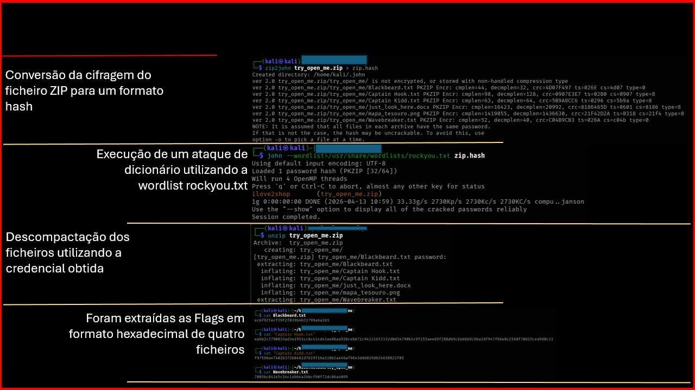
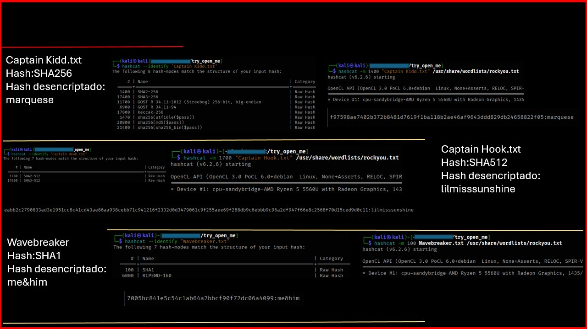
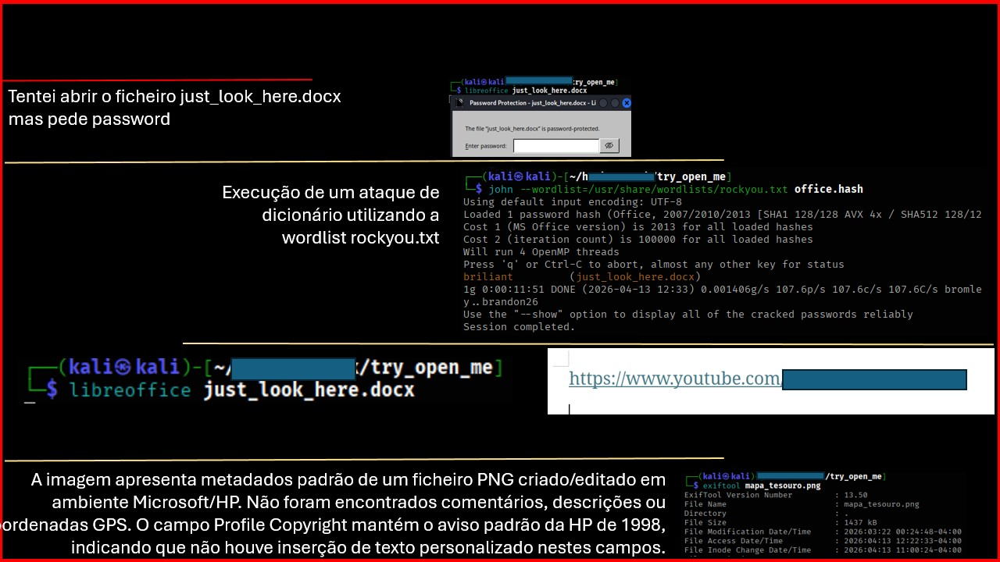
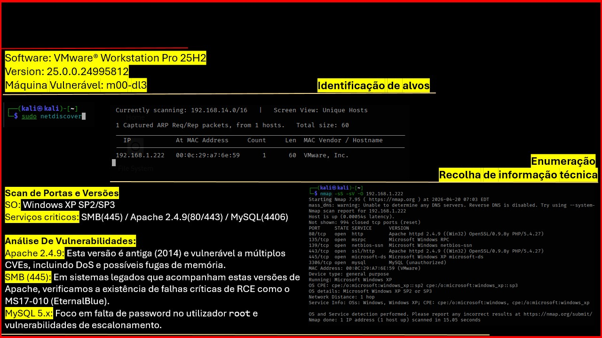
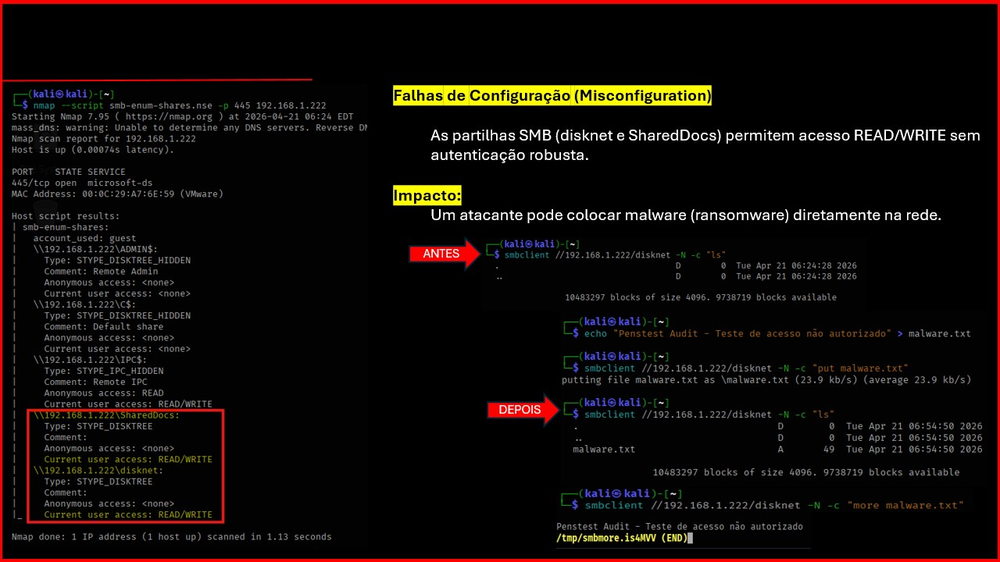
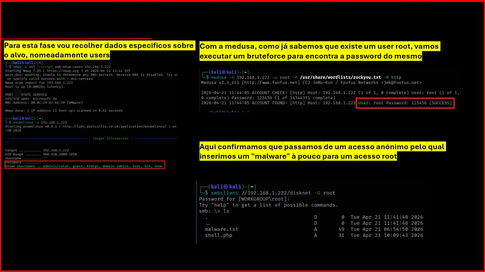
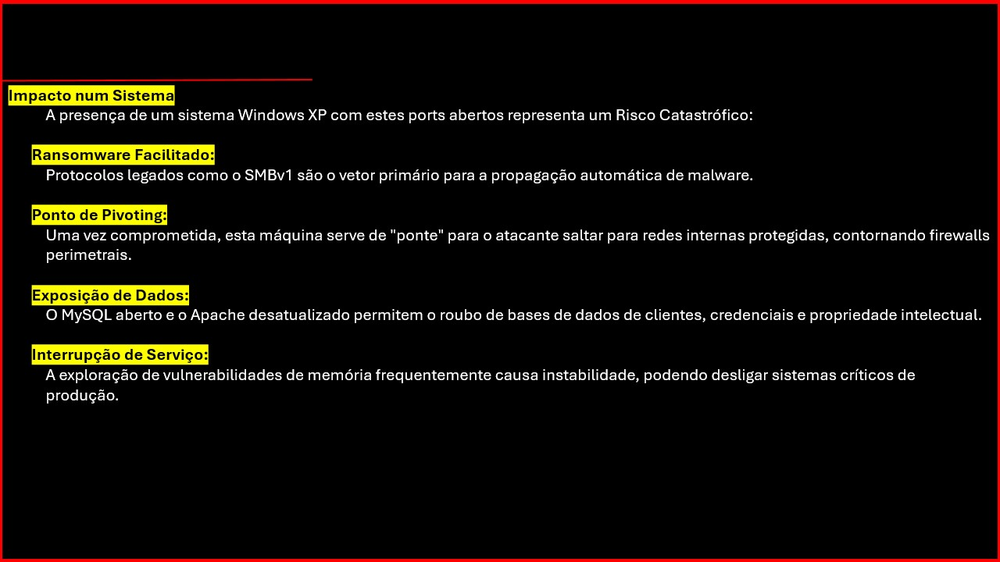
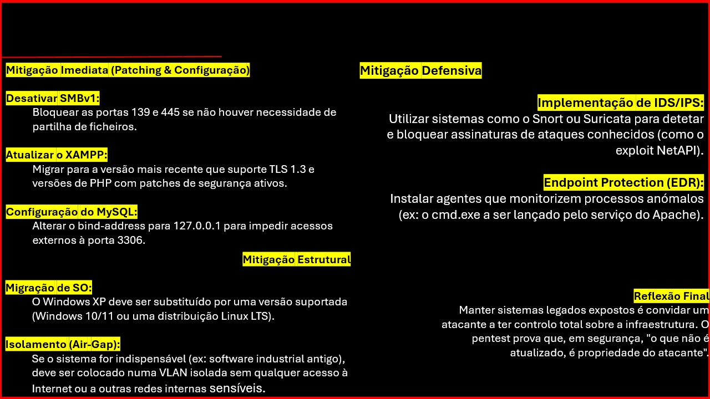

**Author:** FMartinsCyberSec  

---

## 📑 Project Overview
This project documents the resolution of a practical cybersecurity assessment focused on two main pillars:
1. **CTF & Cryptanalysis:** File exploration, metadata analysis, and password cracking.
2. **Technical Pentest:** Full security audit and risk analysis on a vulnerable virtual machine (Windows XP).

---

## 🛠️ Part 1: Forensic Analysis & Cracking (`try_open_me.zip`)

An analysis was conducted on the `hackTHEtask` repository to extract critical information from a protected ZIP file.

### Methodology and Tools:
- **Enumeration:** Listed internal files to identify potential targets.
- **Zip2John & John the Ripper:** Converted the ZIP to a hash and executed a dictionary attack using `rockyou.txt`.
  - **Password Found:** `ilove2shop`

### Decrypted Hashes (Hashcat):
Using **Hashcat**, I decrypted the passwords for the found files and used **Office2John** for the protected document.

| File | Algorithm | Decrypted Password |
| :--- | :--- | :--- |
| `Blackbeard.txt` | MD5 | **maximillian** |
| `Captain Kidd.txt` | SHA2-256 | **marquese** |
| `Captain Hook.txt` | SHA2-512 | **lilmisssunshine** |
| `Wavebreaker.txt` | SHA1 | **me&him** |
| `just_look_here.docx`| MS Office 2013 | **briliant** |

---

## 🛡️ Part 2: Technical Pentest (VM `m00-dl3`)

A technical audit was performed on a vulnerable machine to identify critical infrastructure flaws.

### 🔍 Reconnaissance Phase:
Using `nmap` and `netdiscover`, I identified the target and its exposed services.
- **Target IP:** `192.168.1.222`
- **OS:** Windows XP SP2/SP3 (Legacy system).

### 💣 Identified Attack Vectors:

#### 1. SMB Misconfiguration
The `disknet` share allowed anonymous Read/Write access. I demonstrated this by uploading a test file.
- **PoC:** `smbclient //192.168.1.222/disknet`

#### 2. Privilege Escalation
Using **Medusa**, I identified root user credentials via brute-force, gaining full control over the target.

---

## 💡 Mitigation & Risk Analysis
The exposure of legacy services like SMBv1 poses a high risk, including potential Ransomware deployment.

### Recommendations:
- **Disable SMBv1:** Immediate block of ports 139 and 445.
- **Isolation:** Place legacy systems in isolated VLANs.
- **Hardening:** Implement strict NTFS permissions and monitor for unauthorized file creation.

---

## 🔧 Tools Applied
* **Systems:** Kali Linux.
* **Reconnaissance:** Nmap, Netdiscover.
* **Cracking:** John the Ripper, Hashcat, Medusa.
* **Analysis:** ExifTool, Smbclient.

---
**Note:** All technical steps were performed in a controlled laboratory environment for educational purposes.
